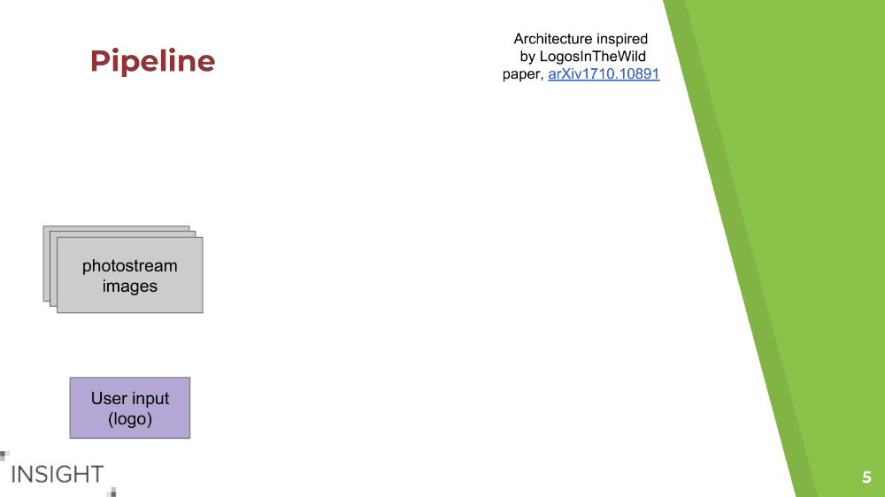

# Insight AI project: Logo detection as a service

Machine learning project developed at Insight Data Science, 2019 AI session.

## Project description
Companies and advertisers need to know their customers to assess their business and marketing strategies. While the amount of information shared on social media platforms is gargantuan, a lot of it is unstructured and untagged, and particularly so for visual data. Users can voluntarily tag their preferred brands in their posts, but wouldn't it be much better for the companies to know every time their brand is being publicly shared?

In this project, I built a general-purpose logo detection API. To avoid re-training the network for each new company using the service, logo detection and identification are split in two logically and operationally separate parts: first, we find all logos in the image with a YOLO detector, and then we check for similarity between the proposed logos and an input uploaded by the customer (for example, the company owning the logo), by computing cosine similarity between features extracted by a pre-trained Inception network.



## Repo structure
+ `build`: scripts to build environment
+ `configs`: configuration files
+ `data`: input data
+ `notebooks`: exploratory analysis, visualization
+ `src`: source code
+ `tests`: unit tests

## Getting Started

#### Requisites
The code uses python 3.6, Keras with Tensorflow backend, and a conda environment to keep everything together. Training was performed on a AWS p2.xlarge instance (Tesla K80 GPU).

#### Installation
Clone this repo with:
```
git clone https://github.com/ilmonteux/logohunter.git
```

Download the pre-trained model weights and the LogosInTheWild features extracted from a pre-trained InceptionV3 network:
```
LINK-TO-WEIGHTS ----------------------->>>>>>


```

#### clone, setup conda environment

Simply setup the conda environment with
```
conda config --env --add channels conda-forge
conda create --name logohunter --file requirements.txt
source activate logohunter
```

## Usage
The script doing the work is [logohunter.py](src/logohunter.py) in the `src/` directory.
```
cd src/
python logohunter.py --test
```

## Build Environment


#### Data
This project uses the [Logos In The Wild dataset](https://www.iosb.fraunhofer.de/servlet/is/78045/) which can be requested via email directly from the authors of the paper, [arXiv:1710.10891](https://arxiv.org/abs/1710.10891). This dataset includes 11,054 images with 32,850 bounding boxes for a total of 871 brands.

The dataset is licensed under the CC-by-SA 4.0 license. The images themselves were crawled from Google Images and are property of their respective copyright owners. For legal reasons, we do not provide the raw images: while this project would fall in the "fair use" category, any commercial application would likely need to generate their own dataset. See below for downloading the dataset.

#### Optional: download, process and clean dataset

Follow the directions in [data/](data/README) to download the Logos In The Wild dataset.

#### Optional: train object detection model
After the previous step, the `data_train.txt` and `data_test.txt` files have all the info necessary to train the model. We then follow the instructions of the [keras-yolo3](https://github.com/qqwweee/keras-yolo3) repo: first we download pre-trained YOLO weights from the YOLO official website, and then we convert them to the HDF5 format used by keras.
```
cd src/keras_yolo3
wget https://pjreddie.com/media/files/yolov3.weights
python convert.py yolov3.cfg yolov3.weights model_data/yolo.h5
```
Training detail such as paths to train/text files, log directory, number of epochs, learning rates and so on are specified in `train.py`. The training is performed in two runs, first with all the layers except the last three frozen, and then with all layers trainable.

```
python train.py
```
